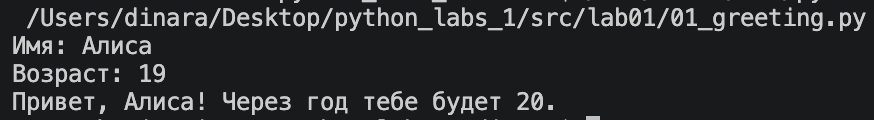
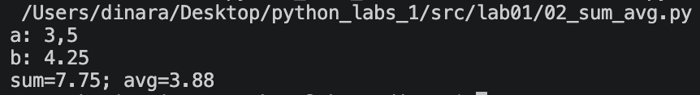
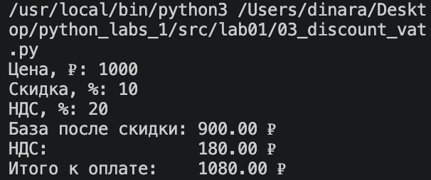
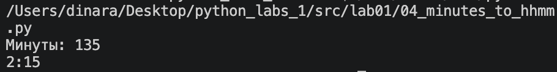
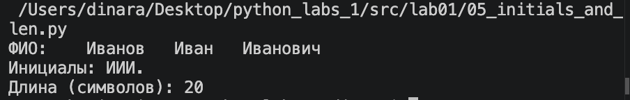
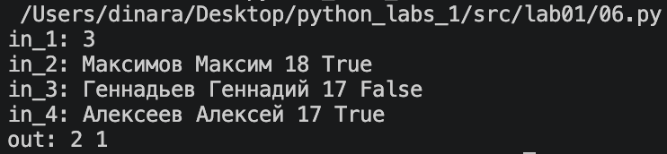

# ЛР1 - Ввод/вывод и форматирование
## Задание 1
### Вывод информации с помощью f-строки (разные типы данных).

## Задание 2
### Обработка чисел, вывод суммы и среднего.

## Задание 3
### Подсчёт базы после скидки, НДС и итоговой суммы.

## Задание 4
### Перевод минут в формат часы:минуты.

## Задание 5
### Поиск и вывод инициалов ФИО, подсчёт длины символов.

## Задание 6
### Обработка заданного n числа студентов, проверка на True/False в данных, подсчёт каждого типа.

