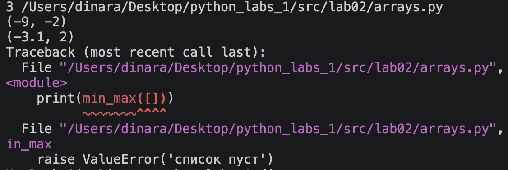
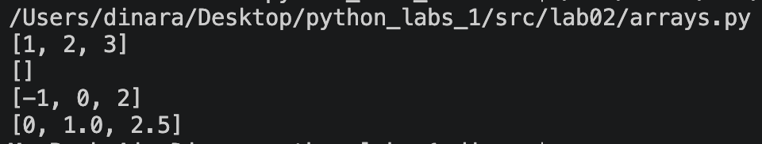
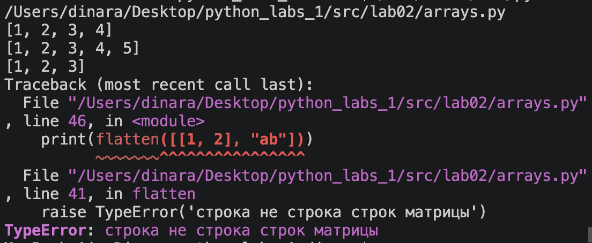
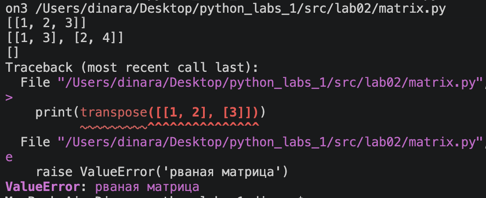
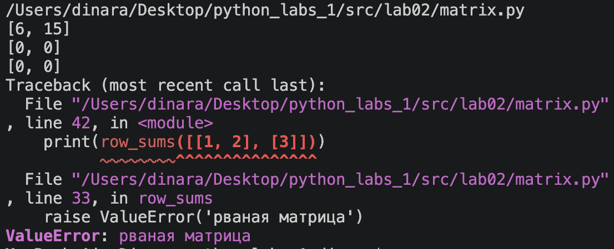
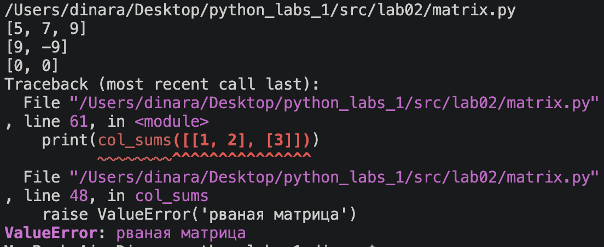
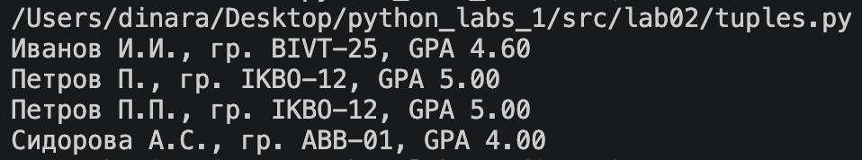

# ЛР2 — Коллекции и матрицы (list/tuple/set/dict)
## Задание 1 (arrays.py)
### min_max

```python
def min_max(nums: list[float | int]) -> tuple[float | int, float | int]:
    """
    На вход подаётся список nums из вещественных или целых чисел,
    функция возвращает кортеж из наименьшего и наибольшего чисел из
    входного списка nums.
    Если список пустой, то вернётся ValueError.
    """
    if len(nums) == 0:
        raise ValueError('список пуст')

    minimum = maximum = nums[0]
    for i in nums:
        if i<minimum:
            minimum = i
        if i>maximum:
            maximum = i
    ans = (minimum, maximum)
    return ans
print(min_max([3, -1, 5, 5, 0]))
print(min_max([42]))
print(min_max([-5, -2, -9]))
print(min_max([1.5, 2, 2.0, -3.1]))
print(min_max([]))
```


### unique_sorted

```python
def unique_sorted(nums: list[float | int]) -> list[float | int]:
    """
    На вход подаётся список nums из вещественных или целых чисел,
    функция возвращает отсортированный список уникальных чисел в порядке возрастания.
    """
    nums = list(set(nums))
    for i in range(len(nums)-1):
        for j in range(len(nums)-1-i):
            if nums[j]>nums[j+1]:
                nums[j], nums[j+1] = nums[j+1], nums[j]
    return nums
print(unique_sorted([3, 1, 2, 1, 3]))
print(unique_sorted([]))
print(unique_sorted([-1, -1, 0, 2, 2]))
print(unique_sorted([1.0, 1, 2.5, 2.5, 0]))
```


### flatten

```python
def flatten(mat: list[list | tuple]) -> list:
    """
    На вход подаётся список из списков или кортежей mat,
    функция возвращает список, содержащий элементы всех входных списков или кортежей.
    В возвращённом списке элементы расположены в той же последовательности, в которой были переданы в функцию.
    Если какой-то элемент не является списком или кортежем, то возвращается TypeError.
    """
    ans = []
    for i in mat:
        if (type(i)==list) or (type(i)==tuple):
            ans += i
        else:
            raise TypeError('строка не строка строк матрицы')
    return ans
print(flatten([[1, 2], [3, 4]]))
print(flatten([[1, 2], (3, 4, 5)]))
print(flatten([[1], [], [2, 3]]))
print(flatten([[1, 2], "ab"]))
```


## Задание 2 (matrix.py)
### transpose

```python
def transpose(mat: list[list[float | int]]) -> list[list]:
    """
    На вход подаётся матрица размера m*n,
    где m - число строк, n - число столбцов.
    Возвращается матрица размера n*m,
    (строки и столбцы меняются местами).
    Для пустой матрицы: [] -> [].
    Если строки в матрице разной длины(рваная матрица), то
    вернется ValueError.
    """
    if mat == []:
        return []

    for row in mat:
        if not isinstance(row,list):
            raise ValueError('матрица должна быть списком списков')
        if len(row) != len(mat[0]):
            raise ValueError('рваная матрица')
    
    stroka = len(mat)
    stolb = len(mat[0])
    res = []
    
    for j in range(stolb):
        res.append([])

    for i in range(stroka):
        for j in range(stolb):
            res[j].append(mat[i][j])
    return res
print(transpose([[1, 2, 3]]))
print(transpose([[1], [2], [3]]))
print(transpose([[1, 2], [3, 4]]))
print(transpose([]))
print(transpose([[1, 2], [3]]))
```


### row_sums

```python
def row_sums(mat: list[list[float | int]]) -> list[float]:
    """
    На вход подаётся матрица из m строк.
    Если во всех строках одинаковое число элементов,
    для каждой строки вернётся сумма её элементов.
    Если строки в матрице разной длины,
    вернётся ValueError.
    """
    for row in mat:
        if len(row)!=len(mat[0]):
            raise ValueError('рваная матрица')
        
    res = []
    for row in mat:
        res.append(sum(row))
    return res
print(row_sums([[1, 2, 3], [4, 5, 6]]))
print(row_sums([[-1, 1], [10, -10]]))
print(row_sums([[0, 0], [0, 0]]))
print(row_sums([[1, 2], [3]]))
```


### col_sums

```python
def col_sums(mat: list[list[float | int]]) -> list[float]:
    for i in mat:
        if len(i)!=len(mat[0]):
            raise ValueError('рваная матрица')

    res = []
    col_num = len(mat[0])
    for j in range(col_num): #по столбцам
        col_sum = 0
        for i in range(len(mat)): #по строкам
            col_sum += mat[i][j]
        res.append(col_sum)
    return res
print(col_sums([[1, 2, 3], [4, 5, 6]]))
print(col_sums([[-1, 1], [10, -10]]))
print(col_sums([[0, 0], [0, 0]]))
print(col_sums([[1, 2], [3]]))
```


## Задание 3 (tuples.py)
### format_record

```python
def format_record(rec: tuple[str, str, float]) -> str:
    """
    На вход подаётся кортеж из строки с ФИО/ФИ,
    строки из названия группы,
    вещественного числа с средним баллом (GPA).
    Возвращается строка вида "Фамилия И.О., группа, GPA"
    Если ФИО состоит только из фамилии или пустое, вернётся ValueError.
    Если группа пустая, вернётся ValueError.
    Если неверный тип GPA, вернётся TypeError.
    """
    if not isinstance(rec, tuple):
        raise TypeError('На вход нужно подать кортеж (tuple)')
    if len(rec)!=3:
        raise ValueError('Кортеж должен содержать 3 элемента: ФИО, группа, GPA')

    fio, group, gpa = rec
    parts = fio.strip().split()
    
    if len(parts)==0:
        raise ValueError('Пустое ФИО')
    if len(parts)<2:
        raise ValueError('ФИО должно содержать минимум фамилию и имя')

    surname = parts[0].capitalize()
    if len(parts)==2:
        initials = f'{parts[1][0].upper()}.'
    else:
        initials = f'{parts[1][0].upper()}.{parts[2][0].upper()}.'
    form_fio = f'{surname} {initials}'

    group = group.strip()
    if len(group)==0:
        raise ValueError('Пустая группа')

    if not isinstance(gpa, (int, float)):
        raise TypeError('Неверный тип GPA')
    if not (0.0<=gpa<=5.0):
        raise TypeError('GPA должен быть в диапазоне от 0.0 до 5.0')

    res = f'{form_fio}, гр. {group}, GPA {gpa:.2f}'
    return res

print(format_record(("Иванов Иван Иванович", "BIVT-25", 4.6)))
print(format_record(("Петров Пётр", "IKBO-12", 5.0)))
print(format_record(("Петров Пётр Петрович", "IKBO-12", 5.0)))
print(format_record(("  сидорова  анна   сергеевна ", "ABB-01", 3.999)))
```
